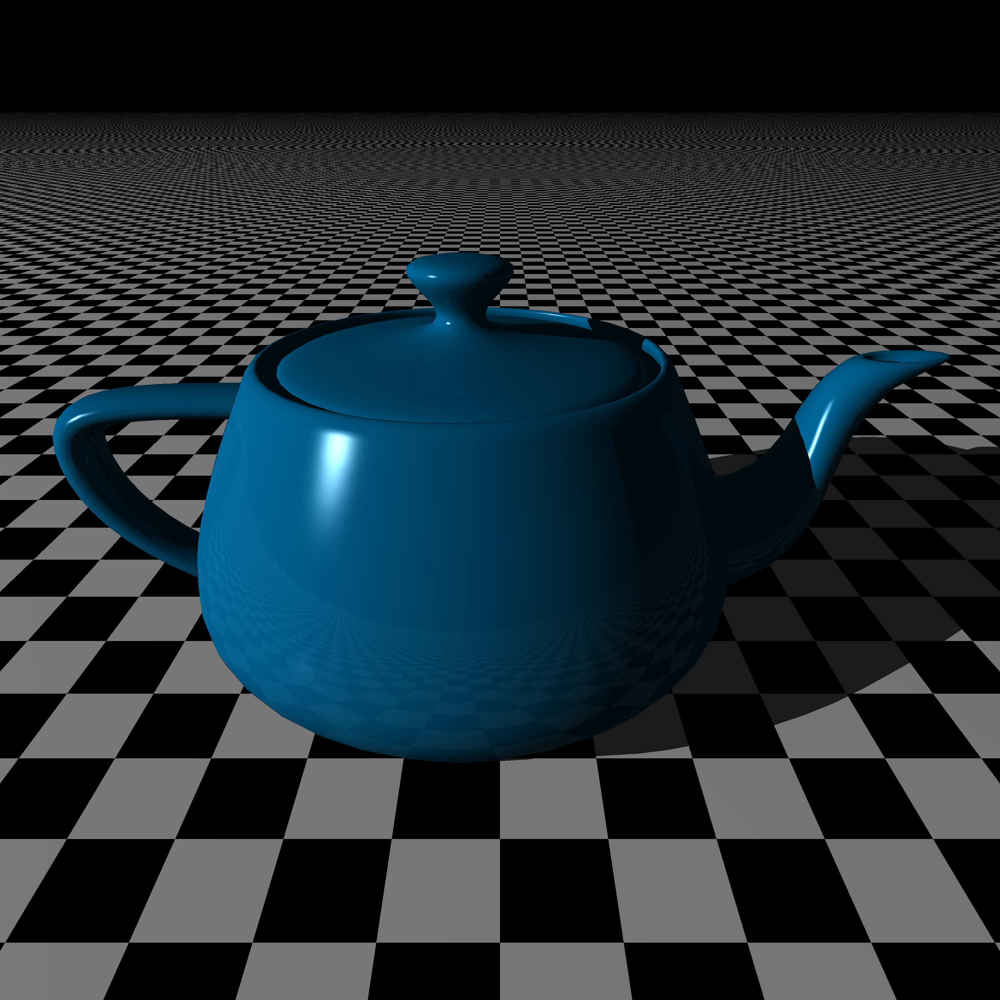

# Scene Renders

## Chapter 6

A simple sphere.

## Chapter 8

Three spheres in a room (created by large spheres).

## Chapter 9

Three spheres in a room (using planes for wall/floor).

## Chapter 10

Three spheres with various patterns.

## Chapter 11

Several spheres (including glass spheres) with a mirror wall behind them.

Several spheres under "water" (a transparent plane that doesn't cast a shadow).

## Chapter 12

A scene using cubes.

## Chapter 13

A scene using various cylinders and cones.

## Chapter 14

A shape using cylinders and spheres in groups.

Randomly generated spheres spread into several groups.

## Chapter 15

An imported image of a teapot using triangles.

## Chapter 16

An image using various CSG objects.

## Bounding Box

An image using many models using hundred of thousands of triangles.

